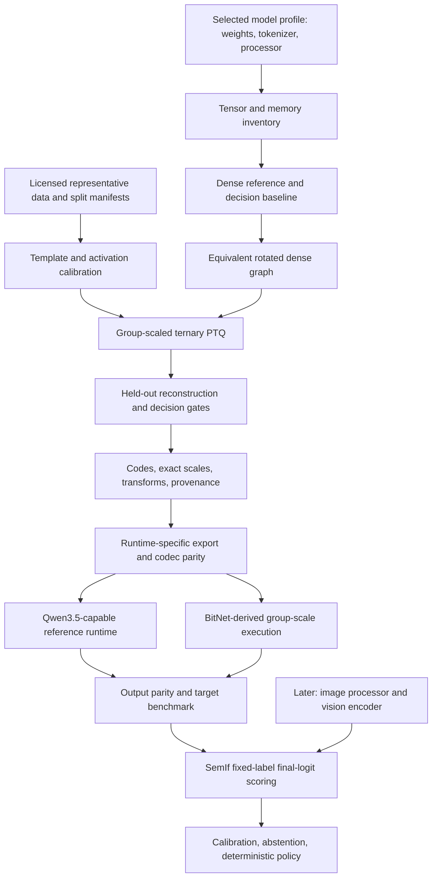

# Embedded Jev Design

Status: proposed architecture, first written 2026-09-25; implementation status
checked 2026-10-08; model-family portability and derivative support tiers
reviewed 2026-10-09. Bounded ternary quantizers, the streamed BF16 text
reference, and a frozen BitNet-derived FFN inside real native MiMo now exist.
Whole-model ternary export, profile-aware model support and deployment services
remain open.
The [current handover](handover.md#current-checkpoint-2026-10-08) records the
tested implementation checkpoint, cache paths, constraints, and next native task.
The [family review](research-audit.md#qwen35-9b-class-family-review) records the
Qwen3.5 9B-class evidence behind the profile requirements below, and the
[derivative review](research-audit.md#derivative-release-review) the evidence
behind the support tiers.
See [docs/research-audit.md](research-audit.md) for evidence and corrections,
[docs/roadmap.md](roadmap.md) for delivery gates, and
[docs/sources.md](sources.md) for inspected upstream revisions.

## Goal and Boundaries

Build a local decision engine accepting evidence, runtime-defined criteria, and
typed options. Support multiple Qwen3.5 9B-class models, compress their eligible
linear projections, execute them through verified BitNet-derived low-bit CPU
kernels, and return SemIf-compatible option scores without generating an answer
sequence. Keep decision and quantization contracts reusable rather than tied
to one model's identity.

MiMo-V2.6-Distill-Qwen-9B is the first test subject, not a permanent model
requirement. Other Qwen3.5 9B-class checkpoints and derivatives are planned
targets, not validated compatibility. The aim is to cover most fine-tuned,
refusal-removed and merged derivatives, plus some wrapped, GGUF-only or
depth-expanded releases through declared adapters; see the
[support tiers](#support-tiers-for-derivatives). Other architecture families
require their own adapters and evidence. A model change need not wait for MiMo's
full-model ternary work to finish; the next model must pass its own support gates.

The intended target is a Linux edge computer with gigabytes of RAM, not a
microcontroller. Start on available x86-64 hardware, then validate ARM64. RISC-V
remains a first-class deployment goal but requires an explicit kernel/toolchain
port, not a speculative build flag. Vision stays in the architecture but follows
a correct text-only path.

Do not promise Bonsai's proprietary quantization quality, a 1.75-bpw whole model,
sub-second cold decisions, or calibrated correctness before measurements. Do not
equate direct option scoring with the model's generated reasoning capabilities.

### Model Profiles and Portability

A planned model profile separates checkpoint identity from shared decision,
quantization and kernel contracts. This is an architecture requirement, not an
already implemented profile-selection API. For each selected model, bind:

- Source ID/revision, licenses, configuration and weight hashes, discovered
   tensor names/shapes, layer types, tied embeddings, and modality support.
- Tokenizer, processor, template and special-token hashes, rendered prompt
   policy, and context-verified option-label IDs; do not inherit MiMo's IDs.
- A versioned architecture/converter adapter with verified tensor mapping,
   head ordering, position/cache semantics, and precision/accumulator contracts.
- Model-specific quantization policy, exact codes/scales/transforms, calibration
   provenance and runtime/build identity; a shared kernel is not a shared artifact.
- Dense reference, codec/kernel dispatch, runtime comparison and quality evidence
   scoped to that model/revision and the capability actually tested.

Do not infer compatibility from a Qwen3.5 or 9B label alone. Derive geometry from
reconciled metadata and reject unsupported profiles rather than relaxing the
current MiMo-specific loader checks. Do not reuse its frozen projection,
calibration captures or caches for another checkpoint. See the
[model support gate](roadmap.md#model-scope-and-support-gate) for onboarding
and the [coupling inventory](development.md#mimo-coupling-inventory) for every
current MiMo-specific assumption in code.

#### Qwen3.5 9B-Class Geometry

"9B-class" names a text-decoder geometry, not a repository name, tag or
`model_type`; for example, a Qwen3.6 27B release also reports `qwen3_5`. A
checkpoint is a candidate only when its own reconciled configuration and
safetensors headers show these values. On 2026-10-09 MiMo's configuration and
headers matched them, as did the configurations of the base `Qwen/Qwen3.5-9B`,
DavidAU's Defiant Fable source and ZDTaichu5.0-9B's nested text decoder. Only
MiMo's text-tensor count is confirmed from headers:

| Property | Required value |
| --- | --- |
| Decoder layout | 32 layers, `full_attention_interval` 4: 24 Gated DeltaNet and 8 gated full-attention layers |
| Widths | Hidden 4,096; FFN 12,288; vocabulary 248,320; untied input and output matrices |
| Full attention | 16 query heads, 4 KV heads, head dimension 256, output gate (`q_proj` has 8,192 rows) |
| Linear attention | 16 key and 32 value heads of dimension 128, convolution kernel 4, FP32 SSM state |
| Positions and norms | Partial rotary 0.25, interleaved MRoPE sections [11, 11, 10], theta 10,000,000, RMSNorm epsilon 1e-6 |
| Text tensors | 427 after excluding vision and MTP tensors |

Matching geometry allows geometry-bound code, synthetic controls and resource
formulas to be reused after the profile gate. It does not transfer weights,
tokenizer or template behaviour, dtype layout, packaging, licence, numerical
evidence, calibration or quality. Releases with these per-layer shapes but
another layer count are [depth variants](#wrapped-decoders-and-depth-variants),
not 9B-class profiles.

#### Packaging Variation Within the Class

Checkpoints with this geometry still differ in ways that current MiMo-pinned code
either refuses or would mislabel. A profile adapter must handle each axis
explicitly or fail closed:

| Axis | Observed variants | Profile requirement |
| --- | --- | --- |
| Architecture and prefixes | Multimodal `Qwen3_5ForConditionalGeneration` (`model.language_model.*`, `model.visual.*`), text-only `Qwen3_5ForCausalLM` (`model.*`), or a custom-code wrapper (ZDTaichu: `language_model.model.*`, text configuration nested as `llm_config`) | Declared name-prefix and configuration-path rule; text-only profiles claim no vision; never execute repository code |
| Shard names | `model-0000N-of-0000M` (MiMo), `model.safetensors-0000N-of-0000M` (base), unpadded `model-N-of-M` (ZDTaichu), or an extra `model-mtp-restored.safetensors` (one merge) | Accept exactly the names in the pinned index; hash every file |
| Index metadata | Exact `total_size` (MiMo), or a stale total omitting a later-added tensor plus tool keys such as `mergekit_version` | Recompute totals from headers and record any mismatch; index metadata is never identity |
| MTP tensors | Absent (MiMo despite its configured MTP layer; text-only exports), complete `mtp.*` (base, 243,290,624 parameters), or with the fusion projection missing or stored in a separate file; configured as `mtp_num_hidden_layers` or `mtp_num_layers` | Exclude explicitly with `--no-nextn`; report presence and completeness separately |
| Small-tensor dtype | All BF16 (MiMo, one merge) or 3,840 F32 parameters (base, a text-only export, another merge) | Allowed dtype per tensor class; never cast silently |
| Template | Different turn separators and non-thinking suffixes (below); some releases add [in-band controls](#templates-with-in-band-controls) | Bind template hash, rendering arguments, exact suffix, prompt hashes and label IDs |
| Tokenizer files | Equal vocabulary and merge sizes, different `tokenizer.json` bytes | Hash files and re-verify HF and native token IDs |
| Licence | MIT, Apache-2.0, custom terms (one listing declares `apple-amlr`), or mixed per component (ZDTaichu names the NVIDIA Open Model License as primary for its weights) | Record terms per component and carry notices into derived artifacts |
| Extra assets | LoRA adapters, auxiliary decision heads, calibration files, separate `mmproj` vision files | Out of scope until their semantics are designed and validated |
| Weight format | Quantized releases (GGUF Q2-Q8 and IQ, FP8 and similar) or float GGUF files | Never quantize from quantized weights; float GGUF only through the [GGUF-source adapter](#float-gguf-sources) |

The same single-message decision request ends differently in the two inspected
templates, so prompt bytes, token counts, hashes and activations differ:

```text
MiMo:  ...<|im_end|><|im_start|>assistant\n<think></think>
Base:  ...<|im_end|>\n<|im_start|>assistant\n<think>\n\n</think>\n\n
```

#### Support Tiers for Derivatives

Most Hub releases built on Qwen3.5-9B are fine-tunes, refusal-removed
("abliterated" or "Heretic") edits, same-shape merges, often made with mergekit,
or repackagings of such weights. The aim is to support most of them, but names,
tags and declared base models are not evidence: a release joins a tier only after
its own files are inspected, and every tier still needs the full profile record
and [support gate](roadmap.md#model-scope-and-support-gate). The examples are
2026-10-09 metadata observations from the
[derivative review](research-audit.md#derivative-release-review), not selections.

| Tier | Source provides | Observed examples | Path and added requirements |
| --- | --- | --- | --- |
| A. 9B-class safetensors | Floating-point safetensors with the geometry above | MiMo; base Qwen3.5-9B; DavidAU's Defiant Fable source; same-shape merges | Packaging adapter, then the pinned converter with `--no-nextn`; the primary target |
| B. Wrapped decoder | A 9B-class text decoder inside a custom-code wrapper | ZDTaichu5.0-9B (C-RADIOv4-H vision, InternVL-style projector) | Static configuration and header reading, declared rename to canonical text names, text-only profile |
| C. Float GGUF only | BF16 GGUF without matching safetensors | The Defiant Fable `plusIQ` BF16 file, unless it matches its safetensors sibling | [GGUF-source adapter](#float-gguf-sources) with an independent layout anchor |
| D. Depth variant | Qwen3.5 blocks of 9B-class width with another layer count | DavidAU's 48-layer "13B" depth expansions | Profile-driven layer count, pattern, tensor counts and budgets |
| E. Not a source | Quantized weights, unmerged adapters, drafts, other widths, vocabularies or MoE | Q2-Q8 and IQ GGUF files, FP8, LoRA bundles, speculative-decoding drafts, 27B and 35B-A3B models | Refused for PTQ; quantized files may serve only as labelled comparison baselines |

Tier A needs the P0 profile work plus each profile's gates; most fine-tunes and
merges are expected there. Tiers B-D each add one adapter with its own fixtures
and evidence, ordered in the [work queue](roadmap.md#generalization-work-queue).
Tier E is refused rather than approximated.

#### Float GGUF Sources

A BF16 GGUF holds converter output, not the original tensors. For Qwen3.5 the
pinned Prism converter permutes linear-attention value heads from grouped to
tiled order in the value rows of `in_proj_qkv`, in `in_proj_z`, `in_proj_a`,
`in_proj_b`, the convolution's value channels, `A_log`, `dt_bias` and the
`out_proj` columns. It also stores `-exp(A_log)`, renames `dt_bias`, squeezes the
convolution and adds 1 to every RMSNorm weight except the gated linear-attention
norm. Eligible projections are therefore only permuted, so their BF16 values are
exactly recoverable; transformed small tensors need per-tensor exactness checks.

A GGUF-only source is weaker than safetensors in three ways:

- No GGUF key records the value-head order or converter revision; the loader
   assumes tiled order. Inverting with our mapping and converting again always
   round-trips, and native output agrees with a reference rebuilt from that
   inversion because both see one consistent relabelling. Neither check detects
   a producer that used another convention.
- Identity is the whole file: hash it and each tensor's data, and bind the
   metadata, embedded template, tensor types and any `nextn` tensors. The pinned
   loader skips MTP tensors unless MTP loading is requested; a profile still
   records and excludes them explicitly. A BF16 type label does not prove that
   values were never rounded through another format.
- The streamed Transformers reference needs reconstructed HF-layout tensors.
   Until that inverse is implemented and proven, only native runs of the file
   itself exist, and they cannot reveal conversion errors.

Accept a float GGUF only with an independent layout anchor, preferably
byte-identical eligible tensors from our own pinned conversion of a sibling
safetensors release. A cheap first check reads the GGUF header and a few eligible
tensors by byte range and compares them with the sibling's tensors; FFN matrices
need no transform. Without an anchor the profile is refused, not approximated.

#### Wrapped Decoders and Depth Variants

A wrapped decoder keeps 9B-class text geometry under another architecture.
ZDTaichu5.0-9B declares `ZDTaichu5_0_ForConditionalGeneration` with an `auto_map`
to repository code and nests a `Qwen3_5ForCausalLM` text configuration as
`llm_config`, using `mtp_num_layers` rather than `mtp_num_hidden_layers`. Its
text tensors are `language_model.model.*` and `language_model.lm_head.weight`,
beside `vision_model.*` and projector `mlp1.*` tensors. A profile may read that
JSON and the safetensors headers statically, map the declared prefix to canonical
text names and convert a text-only subset. It must never execute repository code,
must record the rename as a declared transform with unchanged tensor payload
hashes, and claims no vision: no pinned converter supports that vision tower.

A depth variant keeps every per-layer shape but changes `num_hidden_layers`. Two
observed 48-layer releases declare `full_attention_interval` 4, and their
displayed `layer_types` follow the regular 3:1 pattern. That implies 639 text
tensors and 24,827,168,256 bytes of BF16 text weights. Kernel and codec shapes
are unchanged, but layer counts, tensor totals, trace and capture indices, the
native policy and memory budgets must come from the profile. The pinned
converter writes only `full_attention_interval`, and its `gguf-py` defines no
per-layer key, while the loader also accepts an explicit
`attention.recurrent_layers` array. An irregular pattern therefore needs a
converter extension that writes that array, checked against `layer_types`, or
refusal. Added layers are not added evidence and need their own quality
measurements.

#### Templates With In-Band Controls

Some derivative templates change the rendered prompt according to message text
or extra arguments. The Defiant Fable model card describes `plusIQ` GGUF files
with five reasoning and five instruct modes, selected through `reasoning_effort`
and `enable_thinking` arguments or a `{REASON:mode}` marker anywhere in a
message; the card says the marker is removed from the message stream and persists
until changed. Decision evidence is untrusted text, so such a marker would become
a control channel. A profile must:

- Pin the template hash and every rendering argument, including the mode, and
   verify the suffix and label IDs for exactly that configuration.
- Refuse untrusted fields containing declared control syntax rather than
   stripping it silently, and record the refusal.
- Treat a template embedded in GGUF metadata as a separate file to hash, and
   compare its native rendering and token IDs with the reference renderer.

#### Refusal-Removed and Merged Releases

Refusal removal edits weights to suppress refusal behaviour. The Defiant Fable
card reports, unverified, a KL divergence of 0.0793 and 6/100 refusals for its
Heretic step, followed by further training and merging. Such edits change
activation statistics, so quantization sensitivity is measured per profile.
Decision safety never relies on a model refusing: the advisory, log-only loop and
deterministic limits outside the model still apply, and adversarial instructions
embedded in evidence remain mandatory test cases for every profile.

Merges are structurally Tier A when their tensors keep the 9B-class geometry,
but they inherit no quality or calibration evidence from their parents. Their
packaging is often irregular: the Defiant Fable source index omits the MTP fusion
projection from its total and maps that tensor to a separate restored file.
Profiles exclude MTP, so a stale or restored MTP head affects accounting, not
scoring.

#### Profile Record and Identity Binding

A profile record is small, versioned, non-secret metadata; weights, captures and
quantized artifacts stay outside Git. It should contain at least:

- **Identity:** profile ID and schema version, repository/revision, licence, and
   size plus Git blob ID or SHA-256 for every file used, including each shard.
- **Packaging:** source format and support tier, architecture class, tensor-name
   prefix or rename rule, shard list, MTP and vision handling, expected
   text-tensor count and allowed dtype per tensor class.
- **Geometry:** the class values above, read from configuration and confirmed
   against headers rather than copied from another profile.
- **Tokenization:** tokenizer, configuration and template hashes, special-token
   IDs, every rendering argument (including any reasoning mode), refused control
   syntax, rendered non-thinking suffix, decision prompt formatter version and
   context-verified A-P label IDs.
- **Runtime:** pinned converter/runtime revisions, converter flags, expected GGUF
   metadata and tensor geometry, and the native policy version that accepts it.
- **Quantization and evidence:** eligible tensor names, codec/transform/A8
   contracts, artifact manifests bound by source tensor payload SHA-256, and links
   to the gates that passed for this profile.

Identity must be derived, never assumed. Current MiMo tools take the model ID and
revision from constants and attach them to inventories, label probes, streamed
reports, calibration captures and evaluations regardless of the directory read.
A profile-aware path must verify local files against one profile record before
emitting any report or artifact, refuse directories that match no record, and
keep MiMo's existing results bound to MiMo. Per-run checks can stay cheap:
metadata-file hashes, shard sizes and safetensors header hashes. Full shard
SHA-256 belongs to onboarding and to artifact creation, as the frozen candidate
already requires; header hashes alone do not authenticate payload bytes. Reuse a
derived result across profiles only when the source tensor payload hashes are
identical.

#### Shared Versus Per-Profile Contracts

| Shared once a profile passes its gate | Always per profile |
| --- | --- |
| Group-128 BitNet-derived kernel arithmetic, PQ2 codec and repack, A8 rules | Source files, hashes, licence and packaging rules |
| Transform algebra and Prism v1 metadata constraints | Template, non-thinking suffix, prompt hashes and label IDs |
| Decision request/response schema and conditional softmax | Converter flags, GGUF geometry and native model policy |
| Dataset schema, split and leakage rules (not captures) | Calibration captures, quantization policy and frozen candidates |
| Bounded trace comparator and resource formulas | Dense baseline, precision gaps, quality, calibration and resources |

## Definition of BitNet Capability

We distinguish three properties:

1. **Ternary representation:** selected weights have three values per scale group.
2. **BitNet-derived execution:** real I2_S or TL-family implementations, or a
   documented adaptation of them, execute the projection arithmetic with A8 or
   another explicitly specified activation contract.
3. **Native BitNet training:** the model was trained using a BitNet architecture
   and quantization-aware recipe. Post-training conversion of a dense checkpoint
   does not imply this property.

The post-training route targets properties 1 and 2. If PTQ cannot meet quality
gates, evaluate QAT/distillation recovery rather than renaming a broken artifact.
The official native BitNet 2B model provides a separate control for tooling and
kernel behavior. It cannot silently substitute for the selected test subject
or establish that subject's capabilities.

Acceptance requires profiler/counter evidence that the claimed kernel executes,
plus packed-memory accounting and end-to-end equivalence checks. A GGUF filename,
CMake option, or ternary-valued floating-point checkpoint is insufficient.

## System Layout



The diagram describes dependencies, not a single fully implemented executable.
Quantization begins with inventory and a reference; measuring the reference before
compression is necessary to attribute subsequent errors.

## Offline Quantization

### Inventory First

Read the pinned configuration, tokenizer/template, weight index, and safetensors
headers before allocating the model. Produce an inventory of names, shapes,
dtypes, byte sizes, tied/shared storage, and intended inference use. Account for
vision, norms, embeddings, output head, and any MTP tensors separately.

Use a version-specific architecture adapter. Initial targets are verified FFN
linears and large attention projections. Preserve normalization, convolution,
decay/time-step parameters, and small recurrent-control projections until their
sensitivity is measured. Preserve the reference accumulator dtype independently
of weight storage dtype. Parameter names and runtime recurrent state are different
things; no synthetic recurrent-state tensor belongs in the model checkpoint.

Avoid broad substring rules such as `"D" in name`. Use exact discovered paths,
module types, shapes, and an explicit policy report. Unsupported modules fail
closed. Fused Q/gate and QKV projections need the actual split conventions.

### Calibration Records

Normalize data into structured messages and tool schemas. Use the selected
model's pinned template and tokenizer. MiMo's `reasoning_content` is an example,
not a universal field; include it only when supported, present and licensed.
Do not substitute another model's tokenizer. Keep EOS IDs explicit; token ID
zero is valid, so a boolean `or` fallback is inappropriate.

Maintain three disjoint datasets: quantization calibration, decision probability
calibration/validation, and final evaluation. Split by source conversation,
repository, or capture session before chunking. Record dataset revisions, licenses,
record IDs, hashes, seed, mixture weights, lengths, and deduplication decisions.
Never use SWE-bench test solutions if SWE-bench is a claimed held-out result.

Begin with a small deterministic pilot, then compare token budgets and prompt
lengths. A possible sweep is 32/128/256 sequences and 512/2,048/4,096 tokens,
subject to memory. These are experiment settings, not a proven optimum. Include
short decision-shaped records and the deployment domain. Glaive tool calls and
licensed issue/patch data can supplement them; they are not inherently the best
IoT decision distribution.

Use finite streams with explicit exhaustion, no automatic repeated records, and
bounded buffering. Preserve attention/position semantics across chunks. If
padding is used, mask it in both model execution and activation statistics.
Separate documents require independent state or verified segmented attention;
an EOS delimiter alone does not reset a recurrent network.

### Rotated Reference

Start with blockwise transforms at eligible linear inputs: the same orthogonal
matrix on the activation and the input axis of its weights. Keep the surrounding
network in the original basis. This is easy to test, though not necessarily the
fastest final graph.

Specify block size, normalization, sign vector, transform order, input axis, and
remainder policy per tensor. Treat 1,024 as an experiment, not an immutable
universal constant. Reject unsupported remainder dimensions initially. A random
sign vector must be stored or regenerated using a fully specified algorithm;
a seed alone is insufficient across different random-number generators.

Before rounding any weight, verify original versus rotated logits and intermediate
outputs. This catches missing transforms, transposes, repeated transforms on
shared inputs, and incorrect bias handling. Only then collect covariance in the
rotated basis or transform the corresponding covariance consistently.

### Ternary Reconstruction

Store a ternary code and one scale per output row and contiguous input group.
Group size 128 is the initial target for PTQ1_0/PQ2_0 compatibility experiments.
Keep scale-group size separate from the processing block used to amortize GPTQ
updates. Do not refit a group scale midway without revisiting already assigned
codes and their propagated error.

Use a reviewed GPTQ implementation as the algorithm reference and preserve its
license if adapting code. Calculate token-normalized second moments in FP32 or
higher, apply documented damping, and use the correct inverse-Cholesky factor.
Retry bounded damping increases with diagnostics; fail on persistent nonfinite or
non-positive-definite results. No silent pseudoinverse fallback.

Sweep damping and scale search on representative early, middle, and late blocks,
including full and linear attention. Local reconstruction is a screening metric,
not a guarantee of whole-model perplexity or decision quality. Keep activation
ordering off initially unless its permutation and scale-group mapping can be
represented exactly by the chosen runtime.

FP16 scale storage is part of quantization: use the representable scale when
assigning codes and reconstructing exported values, or explicitly measure the
additional scale-rounding error. Reject overflow/nonfinite scales. Specify
all-zero groups and tail padding. Export codes and original scales directly,
never infer scales again from a rounded BF16 checkpoint.

### Sequential Execution and Recovery

Load only the active block and required frontend modules to the calibration
device. Capture all actual block arguments, including position/rotary data and
masks. Run with `eval`, no gradients, and controlled cache state. Process dependent
projections in an order that accounts for upstream quantization changes.

Re-run each quantized block to generate the next block's calibration inputs.
Offload/release factors between projection groups rather than keeping every
Hessian at once. Bound or memory-map activation banks, reserve factorization
scratch, and report observed peak memory. Checkpoint each completed block with
hashes so an interrupted run can resume without mixing configurations.

If quality fails, first check parity and calibration correctness. Then evaluate
group size, rotation placement, scale optimization, selective higher precision,
or QAT with a teacher. Q4/Q8 results are controls and possible negotiated fallback
products, not completion of the ternary objective.

## Artifact Contract

Use safe, non-pickle tensor storage for intermediate codes, scales, and transforms,
plus a versioned JSON manifest. Native packed inference artifacts are separate.
A [bounded toy container](../embedded_jev/ternary_artifact.py) now exercises this
boundary for in-memory RTN/compensated fixtures only: non-pickle NumPy arrays,
hashed payloads, and explicit identity or signed-Hadamard metadata. It is not
a native model artifact or the full provenance manifest described below.
A toy Prism v1 metadata compatibility check requires full logical input widths,
one block size, and one sign vector per width. A conservative candidate mapper
can derive those widths from the pinned reconciled MiMo headers; it fails if
a 256-wide slice is named as a full 12,288-wide projection. The pinned Prism
Qwen3.5 tensor-name map does not accept raw MiMo
`model.language_model.layers.*` paths, but the shared converter filter removes
`language_model.` before name mapping. A pinned source-only check confirms that
selected FFN/attention projections then map. It does not establish complete
converter support, write GGUF, or validate a loader.

| Manifest section | Required content |
| --- | --- |
| Source | Model profile ID, HF ID/revision, weight hashes, license, architecture and config hash |
| Tokenization | Tokenizer/processor files, hashes, template hash, special IDs |
| Quantization | Algorithm/version, seeds, module policy, group axis/size, dtype, damping, traversal |
| Transforms | Per-tensor mapping, normalization, sign/permutation data, order, remainder handling |
| Calibration | Dataset revisions, sample manifest hash, split roles, token budgets |
| Payload | Logical shapes, code/scale hashes, source tensor payload SHA-256, retained tensor names, exact byte counts |
| Runtime | Repository/commit/submodules, format/version, ISA, compiler/build flags, activation and accumulator policy |
| Validation | Codec parity results, model-quality report, hardware benchmark reference |

Export is permitted only when loader, tensor types, metadata, and graph operations
agree. GGUF permits mixed tensor types; it does not require uniform precision.
Do not label opaque packed bytes as `I8` and expect a ternary matmul. Use the
runtime's Qwen3.5 name mapping and tokenizer conversion, not raw HF tensor names.
Unknown transform metadata must be rejected, not silently ignored.

The inspected Prism schema uses a single power-of-two Hadamard block size and
one sign vector per input width, with explicit weight-name and optional GDN
permutation metadata. Our initial export must respect those constraints even if
the internal artifact can describe more general transforms. Determine tied-output
semantics separately for every model profile. The first test subject, MiMo,
is untied:
do not select version-2 tied-output semantics or remove its output tensor to save
space; the ordinary loader can then substitute the input embedding and change
the function. A selected-label head needs a deliberate loader/graph extension.

## Runtime Integration

### Two Explicit Tracks

**Native BitNet control:** build an immutable Microsoft BitNet revision with its
pinned llama.cpp submodule and an officially supported checkpoint. Verify actual
I2_S dispatch, final logits, and a no-sampling decision readout. TL1/TL2 require
their own format, generated kernels, and shape validation. Do not enable a LUT
flag and assume an I2_S tensor uses it.

**Qwen3.5 9B-class target (MiMo first):** keep the validated model's hybrid graph
in a capable llama.cpp/Prism base, then port the selected Microsoft BitNet kernel
into that graph with explicit
group-scale and activation-transform support. This is the initial preferred
integration direction because it keeps hybrid attention and vision in a runtime
that already represents them. Re-evaluate against extending BitNet's own fork
after a small integration spike; no choice is validated by this document alone.

First implement a portable correctness reference. Then compare a BitNet-derived
I2_S-style W2A8 path against a TL/T-MAC-derived path, including preprocessing.
The group-scale adaptation must compute and rescale group partial sums correctly.
The inspected I2_S tensor-global scale cannot be reused unchanged.

A bounded pinned-Prism control now attaches a BitNet tensor trait through a
registered CPU weight-buffer type and executes `MUL_MAT` with native group-128
A8. Its PQ2 ternary storage is explicitly repacked to the BitNet lane contract;
independent FP16 row/group scales are expanded exactly, not refitted. Counted
dispatch and exact direct-kernel parity pass on the sole full-size projection.
This is buffer/tensor registration, not a new GGUF type or loader integration.
The scoped internal-ABI probe is single-threaded, with global registration
removed after initialization/compute. Native create/compute/free handles now
retain immutable weight/graph ownership and one validated repack across calls;
failed-input recovery and idle registry cleanup pass. The Python-hosted
`prism_ggml_registered` substitution has exact full-text and typed synthetic
score parity with direct execution, with native production A8 and explicit
release. Those handles do not establish production registry concurrency or
loader-selected execution. A bounded native file adapter can now import one explicitly tagged
identity-only PQ2 ternary weight via the pinned GGUF parser into that owned
handle. Toy file ownership/parity and contract/type/geometry/payload refusal
pass, but this is not an automatic model-loader policy or complete MiMo GGUF.
Stock PQ2 execution retains its distinct
Q8_0/Q8_K contract and is not evidence of BitNet dispatch. See the
[registered-tensor control](development.md#registered-bitnet-weight-tensor-control).

A subsequent versioned `JEV_BITNET_LOADER_V1` buffer now survives early CPU
discovery, refuses late initialization, and owns traits per allocated tensor.
Changing bounded token batches dispatch the genuine grouped kernel with one
weight repack. It deliberately refuses the loader's zero-size dummy probe to
avoid implicit ordinary-PQ2 reassignment. A metadata-gated exact public loader
override now passes actual pinned loader selection/upload and counted BitNet
dispatch, including a transient unchanged full-size projection encoding.
Untagged PQ2 remains ordinary CPU. Initialized read-only mixed graph concurrency
also passes; single-threaded early initialization, validated file identity, and
library lifetime are explicit caller requirements. Registry/lifecycle race
safety and complete native model hosting are not established.

A standalone versioned build now packages the full pinned llama library against
the unchanged GGML CPU/base dependencies. Guarded vocabulary-only conversion
and public native load match HF's rendered prompt and label token IDs without
reading source weights or generating tokens. Header-only native-reference
resource planning preserves both full vocabulary matrices and excludes vision
and optional MTP; the source-dtype floor is 16.678 GiB. Converter staging and
native cache/scratch remain additional costs. At `462dc12`, one approved temporary
text-only BF16 reference loaded and prefilled all 32 real MiMo text layers on an
80-token engineering fixture, with typed labels and zero generation. The native
versus streamed BF16 maximum logit gap was 0.09715080261230469; exact numerical
acceptance remains open. The temporary GGUF was deleted afterward. At `669ed7b`,
the separately approved mixed model also loads and prefills the same prompt with
one counted BitNet dispatch, one repack, and 80 measured input rows. The additive
complete-model policy binds exact frozen target bytes against a tagged reference,
keeps both BF16 vocabulary matrices, and refuses other quantized tensors or
Hadamard metadata. It is declared-policy/target validation, not all-source
authentication or a complete architecture check. The native loader checks
structure; callers retain library lifetime and load the same unchanged files.
Real no-score kernel refusal and cleared-context recovery pass. Native/streamed
selected-logit and conditional-score gaps are 0.06760978698730469 and
0.0009491202828953993, not exact parity or quality acceptance. Both temporary
files and spill were deleted; the sole retained candidate is unchanged.
Whole-model ternary conversion is not implied. See the
[staged plan](development.md#native-hosting-preflight-and-conversion-plan).

A bounded synthetic four-layer native Qwen3.5 model now also loads and prefills
through public llama APIs, with a nonzero BitNet-derived layer-3 FFN projection.
Two independent FP16 row/group scales and native A8 reproduce independent
reference logits and reordered typed conditional scores, without generation.
Chunked prefill and cleared-context reuse retain one repack and one kernel call
per successful decode; invalid weight data produces no scores. Independent
small fixed-gate recurrent and single-plane attention references now also pass
with explicit FP16 KV caches. Two initialized contexts sharing immutable weights
preserve separate prefix histories on separate threads. Failed kernel status/NaN
logits are refused even when native decode succeeds; context reset and restored
rounding recover correct scores without repacking. At `ecc6cbd`, a per-weight
diagnostic verifies actual three-/two-/128-row BitNet batches, including the
maximum model prefill; these are not inferred from prompt length. Dense native
text scoring also verifies distinct single-token A/B/C labels and unchanged
prompt token prefixes under label concatenation, without sampling or template
selection. These checks use synthetic weights/vocabulary. This is a tiny test-only
override, not the production one-tensor factory, real MiMo hosting, meaningful
real-model label scores, general recurrent/attention or lifecycle-race safety,
or task-quality evidence.

The real dense reference contained 427 BF16/F32 text tensors and both vocabulary
matrices, with selected embedding/head source bytes checked exactly. Native
prefill used explicit F16 KV/F32 recurrent state; pinned embedding gathers and
matrix products return F32 rather than the streamed BF16 hidden dtype. These
precision differences do not fully explain the measured gap or establish a
general parity tolerance. The opt-in real-model test does not convert weights,
and dense hosting does not attest BitNet dispatch or calibrated confidence.

Bounded trace diagnostics now separate these concerns: identical embeddings first
diverge at layer 0, before the frozen layer-3 projection; native-input replay of
that projection is bit-for-bit exact. The pinned BF16 CPU matmul uses BF16 RHS
operands despite F32 graph outputs. Fixture-only F32-state/BF16-RHS experiments
improve some agreement without matching all recurrent/attention/cache/reduction
contracts. Trace metrics are not acceptance tolerances or calibration artifacts.
See the [precision diagnostic](development.md#bounded-prefill-precision-diagnostic).

Separate recurrent controls now verify native clamped Q/K normalization,
tiled-head output/final-state arithmetic, and fused raw sigmoid/softplus gates.
The converter reorders grouped HF V weights/gates to the kernel's tiled order.
A fixture-only Q/K experiment nevertheless worsens the selected-logit gap on
the engineering prompt; operation-level agreement is not full-model parity or
policy promotion. See the
[recurrent diagnostics](development.md#recurrent-operation-diagnostics).

The 1.75-bpw storage target may require PTQ1_0 on disk and a different packed
execution layout. Report resident packed bytes and scratch separately: expanding
trits to two bits at load time changes RAM and bandwidth, even without FP16
expansion. A compact file is not proof of compact execution.

**Profile generalization limits.** The native policy and trait are deliberately
MiMo- and one-projection-specific. The v1 complete-model factory requires MiMo's
revision and model tags, 427 tensors, `qwen35` 32/4,096/12,288 geometry,
248,320-row BF16 vocabularies, at most 19 GiB and the single
`blk.3.ffn_down.weight` target. The BitNet trait accepts only that tensor name,
at most 4,096 output rows, 96 input groups and 128 tokens. Whole-model ternary on
any 9B-class profile also needs FFN gate/up (12,288 rows) and `q_proj` (8,192
rows), plus linear-attention `in_proj_qkv` (8,192 rows) if it becomes eligible.
Do not loosen v1. Add a versioned policy whose geometry and every quantized
target's exact bytes come from a verified profile and artifact manifest, not
from file tags alone. The current trait also retains the PQ2 block (34 bytes),
repacked BitNet lanes (32 bytes) and an expanded FP32 scale (4 bytes) for every
128 weights: about 4.4 bpw resident versus 2.125 bpw on disk. For MiMo's
5,301,600,256 eligible parameters that is roughly 2.90 GB versus 1.41 GB, before
A8 scratch; remove the duplication before quoting edge memory budgets.

### Numerical Order

The first optimized candidate uses:

`original activation -> FP32 block rotation -> dynamic A8 -> ternary kernel -> group rescale`

Keep activation zero handling, clipping, rounding, signedness, accumulation width,
and output dtype in the contract. INT32 accumulation is the initial reference.
Integer FWHT is a later optimization with explicit overflow and parity tests;
INT16-only butterflies are not accepted without a proven staged-scaling design.

Retain non-linear, normalization, attention, and recurrent computations at their
validated precisions. This is not an integer-only transformer. Cache policy and
weight policy are independent. Do not quantize KV or recurrent caches in the same
experiment as the first weight conversion.

### Native Boundary

Prefer the existing SemIf llama.cpp scoring contract for a compatible build.
Where fork ABIs diverge, compile a small adapter against the exact native headers
and expose a versioned JSONL executable interface first. This keeps Python-side
struct guesses and incompatible `libllama` objects out of one process.

A later library interface must own model/context lifetimes, return lengths and
errors, copy logits before another evaluation invalidates them, and support
explicit release. The API should provide tokenization, direct scoring, optional
prefix snapshot/restore, and capabilities. No undocumented `bitnet_eval_prompt`
symbol is assumed.

Record the actual loaded native library, build ID, enabled kernels, and fallback
counts. An optimized run must fail its acceptance gate if target projections
silently execute the floating-point reference implementation.

## Decision Interface

Reuse SemIf's input fields: `id`, `state`, `question`, and `options` containing
stable IDs and natural-language descriptions. Initially allow 2-16 options.
Semantic IDs need not be tokenizer tokens. Map them to fixed labels A-P and
verify each label extends the exact rendered prompt by one distinct token.

Preserve the state before the changing criterion/options for cacheable workloads.
Use the selected model's verified non-thinking template policy and record the
exact bytes, token IDs, and prompt hash. Do not assume MiMo's thinking switch or
answer slot applies to another model; the inspected base Qwen3.5 template already
renders different separators and suffixes (see
[packaging variation](#packaging-variation-within-the-class)). Assert
GGUF/native tokenization matches
that model's reference tokenizer, including special-token handling. Reject
overlong inputs rather than silently truncating important evidence. Where a
profile's template interprets markers in message text, refuse untrusted fields
containing them; see [template controls](#templates-with-in-band-controls).

Score final requested-position logits, with no generation loop, sampling,
repetition penalty, top-k, or top-p processing. Apply stable softmax restricted
to label logits. Return option IDs, raw logits, conditional probabilities,
selected ID, token counts, timing, artifact/build IDs, and calibration status.
Invalid or nonfinite logits are errors, not a uniform fallback distribution.

Where the full head is available, record the total probability mass assigned to
allowed labels and the full-vocabulary argmax. A high conditional score can hide
very low absolute answer-label mass. Temperature scaling is fitted after final
quantization and activation settings are frozen, on separate labeled data.

Include an explicit insufficient-evidence option where appropriate, plus policy
abstention for invalid input, low margins, out-of-domain evidence, or expired data.
These are different from a guaranteed model confidence. Test label permutations,
paraphrases, irrelevant context, and adversarial instructions embedded in evidence.

### Typed Primitives

The first interface is SemIf categorical scoring, including binary choices. Later
adapters can expose Choice-like selection, Noul-like probability of true, and
Score-like ordinal expectations. For ordinal levels $0,\ldots,K-1$, return
$\sum_k k p_k$ with the full level distribution and rubric version. Do not call
this a continuous regression model or assume all rubric spacings are physically
meaningful. A yes-probability is not a graded measurement of how true a property is.

Return `max_option_probability` by that name. Any separate concentration statistic
needs a named formula/version; empirical calibration needs its own artifact and
validation. Do not label the maximum softmax value as TypeSafe's confidence.
The initial 16-label limit and serial CPU suffix execution are intentional limits,
not full compatibility with Jev's 255-option and parallel-question service.
Decompose complex questions and combine results in deterministic application
code, but do not multiply marginal scores as joint probabilities without a
justified dependence model.

### Prefix Reuse

Use exact token-prefix identity, not just equal state strings. Cache keys include
model and quantization hashes, tokenizer/template, prefix IDs, precision policy,
and image/processor hashes for vision. Restore **all** KV, recurrent, convolution,
and position state. Never share mutable branch state across requests.

The inspected SemIf llama.cpp backend uses sequence serialization because hybrid
Qwen3.5 does not support its ordinary copy/tail-removal route. Its shared CPU path
loops over restored suffixes; it is not true parallel suffix evaluation. Start
serially, measure snapshot size/copy time, and require repeated-request and
branch-order tests before adding concurrency or batched suffixes.

The pinned Prism `build_rs_cache_view` contains a source-disclosed cache-row
relocation hazard for multiple sequences. Keep `n_seq_max=1` for the initial
integration and test a fixed or conservative gather path before enabling branch
batching. This is an upstream risk to verify, not a bug reproduced or fixed here.

### Selected Output Head

After full-head parity, a decision-only build may compute just the A-P output
rows from the final normalized hidden state. This removes most head storage and
projection work while preserving conditional label logits for a linear head.
It requires a custom loader/graph and cannot provide full-vocabulary perplexity,
allowed-label mass, or arbitrary text generation. Retain a separate full-head
artifact for those diagnostics. Input embeddings are not removed.

## Vision and Device Control

For a model profile with vision support, use its actual processor, image
normalization, resizing, patch/merge geometry, and multimodal positional inputs.
A textual camera description is not image inference; image placeholder tokens
alone do not compute image embeddings.
Export a projector only through a converter supporting this exact architecture.
The old LLaVA conversion example in the PDF is not an established MiMo route.
Text-only model profiles do not acquire vision support from the shared interface.

Keep image resolution/token budgets explicit and benchmark preprocessing, encoder,
language prefill, and scoring separately. Weight calibration for a vision-enabled
language backbone must include representative image-derived activations.

The first device loop is advisory and log-only. Model scores must not directly
drive heaters, locks, or other consequential actuators. Use deterministic limits,
freshness checks, watchdogs, bounded queues, and a safe fallback outside the model.
No networking or camera devices are exposed by the research container by default.

## Open Decisions

- Next model ID/revision and modality; MiMo remains the first measured subject,
  not a requirement for later deployment. The user is interested in DavidAU's
  Defiant Fable releases and ZDTaichu5.0-9B; the
  [derivative review](research-audit.md#derivative-release-review) recommends the
  Defiant Fable safetensors source first, but none is selected.
- Which support tiers beyond A to fund, and in what order: float GGUF sources,
  wrapped decoders or depth variants.
- Policy for templates with in-band controls and for refusal-removed models in
  decision deployments.
- Where versioned profile records live and who approves a new record.
- Per-profile numerical acceptance criteria for native-versus-reference agreement,
  decided before a new profile's native comparison rather than after it.
- Whether text-only exports, adapter bundles or auxiliary decision heads are in
  scope, and the licence policy for redistributing derived ternary artifacts,
  including releases with mixed per-component licences.
- Host CPU, RAM, GPU/VRAM, driver, storage budget, and permitted download budget.
- First target device and acceptable p95 latency, context size, and power budget.
- Text-only versus image-enabled first deployment, and number of criteria/state.
- Minimum decision accuracy and maximum degradation relative to each selected
   model's dense baseline.
- Whether selective higher precision and QAT recovery are acceptable if needed.
- Whether a decision-only head is acceptable or text-generation fallback is required.

These decisions control later experiments; they do not block the current
environment, source audit, or model-free tests.