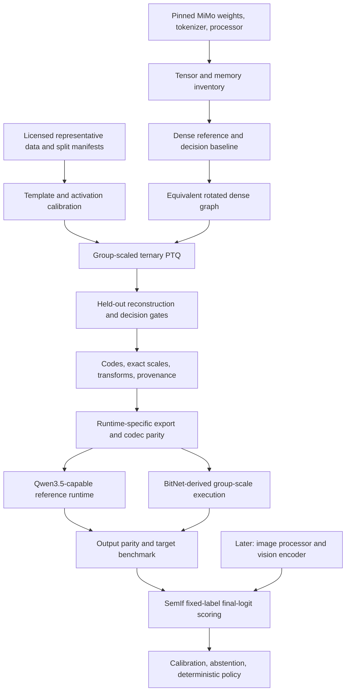

# Embedded Jev Design

Status: proposed architecture, first written 2026-09-25; implementation status
checked 2026-10-01. Bounded ternary quantizers, the streamed BF16 text reference,
and one-projection BitNet-derived native integration now exist. A complete
model-loadable ternary/BitNet runtime and deployment service do not.
The [current handover](handover.md#current-checkpoint-2026-10-01) records the
tested implementation checkpoint, cache paths, constraints, and next native task.
See [docs/research-audit.md](research-audit.md) for evidence and corrections,
[docs/roadmap.md](roadmap.md) for delivery gates, and
[docs/sources.md](sources.md) for inspected upstream revisions.

## Goal and Boundaries

Build a local decision engine accepting evidence, runtime-defined criteria, and
typed options. Compress MiMo-V2.6-Distill-Qwen-9B, execute its eligible linear
projections through verified BitNet-derived low-bit CPU kernels, and return
SemIf-compatible option scores without generating an answer sequence.

The intended target is a Linux edge computer with gigabytes of RAM, not a
microcontroller. Start on available x86-64 hardware, then validate ARM64. RISC-V
remains a first-class deployment goal but requires an explicit kernel/toolchain
port, not a speculative build flag. Vision stays in the architecture but follows
a correct text-only path.

Do not promise Bonsai's proprietary quantization quality, a 1.75-bpw whole model,
sub-second cold decisions, or calibrated correctness before measurements. Do not
equate direct option scoring with the model's generated reasoning capabilities.

## Definition of BitNet Capability

We distinguish three properties:

1. **Ternary representation:** selected weights have three values per scale group.
2. **BitNet-derived execution:** real I2_S or TL-family implementations, or a
   documented adaptation of them, execute the projection arithmetic with A8 or
   another explicitly specified activation contract.
3. **Native BitNet training:** the model was trained using a BitNet architecture
   and quantization-aware recipe. Post-training conversion of MiMo does not imply
   this property.

The MiMo route targets properties 1 and 2. If PTQ cannot meet quality gates,
evaluate QAT/distillation recovery rather than renaming a broken artifact.
The official native BitNet 2B model provides a separate control for tooling and
kernel behavior. It cannot silently substitute for MiMo or its vision capability.

Acceptance requires profiler/counter evidence that the claimed kernel executes,
plus packed-memory accounting and end-to-end equivalence checks. A GGUF filename,
CMake option, or ternary-valued floating-point checkpoint is insufficient.

## System Layout

The diagram describes dependencies, not a single fully implemented executable.
Quantization begins with inventory and a reference; measuring the reference before
compression is necessary to attribute subsequent errors.

## Offline Quantization

### Inventory First

Read the pinned configuration, tokenizer/template, weight index, and safetensors
headers before allocating the model. Produce an inventory of names, shapes,
dtypes, byte sizes, tied/shared storage, and intended inference use. Account for
vision, norms, embeddings, output head, and any MTP tensors separately.

Use a version-specific architecture adapter. Initial targets are verified FFN
linears and large attention projections. Preserve normalization, convolution,
decay/time-step parameters, and small recurrent-control projections until their
sensitivity is measured. Preserve the reference accumulator dtype independently
of weight storage dtype. Parameter names and runtime recurrent state are different
things; no synthetic recurrent-state tensor belongs in the model checkpoint.

Avoid broad substring rules such as `"D" in name`. Use exact discovered paths,
module types, shapes, and an explicit policy report. Unsupported modules fail
closed. Fused Q/gate and QKV projections need the actual split conventions.

### Calibration Records

Normalize data into structured messages and tool schemas. Use the pinned MiMo
template, including real `reasoning_content` only when present and licensed.
Do not substitute a Qwen2.5 tokenizer. Keep EOS IDs explicit; token ID zero is
valid, so a boolean `or` fallback is inappropriate.

Maintain three disjoint datasets: quantization calibration, decision probability
calibration/validation, and final evaluation. Split by source conversation,
repository, or capture session before chunking. Record dataset revisions, licenses,
record IDs, hashes, seed, mixture weights, lengths, and deduplication decisions.
Never use SWE-bench test solutions if SWE-bench is a claimed held-out result.

Begin with a small deterministic pilot, then compare token budgets and prompt
lengths. A possible sweep is 32/128/256 sequences and 512/2,048/4,096 tokens,
subject to memory. These are experiment settings, not a proven optimum. Include
short decision-shaped records and the deployment domain. Glaive tool calls and
licensed issue/patch data can supplement them; they are not inherently the best
IoT decision distribution.

Use finite streams with explicit exhaustion, no automatic repeated records, and
bounded buffering. Preserve attention/position semantics across chunks. If
padding is used, mask it in both model execution and activation statistics.
Separate documents require independent state or verified segmented attention;
an EOS delimiter alone does not reset a recurrent network.

### Rotated Reference

Start with blockwise transforms at eligible linear inputs: the same orthogonal
matrix on the activation and the input axis of its weights. Keep the surrounding
network in the original basis. This is easy to test, though not necessarily the
fastest final graph.

Specify block size, normalization, sign vector, transform order, input axis, and
remainder policy per tensor. Treat 1,024 as an experiment, not an immutable
universal constant. Reject unsupported remainder dimensions initially. A random
sign vector must be stored or regenerated using a fully specified algorithm;
a seed alone is insufficient across different random-number generators.

Before rounding any weight, verify original versus rotated logits and intermediate
outputs. This catches missing transforms, transposes, repeated transforms on
shared inputs, and incorrect bias handling. Only then collect covariance in the
rotated basis or transform the corresponding covariance consistently.

### Ternary Reconstruction

Store a ternary code and one scale per output row and contiguous input group.
Group size 128 is the initial target for PTQ1_0/PQ2_0 compatibility experiments.
Keep scale-group size separate from the processing block used to amortize GPTQ
updates. Do not refit a group scale midway without revisiting already assigned
codes and their propagated error.

Use a reviewed GPTQ implementation as the algorithm reference and preserve its
license if adapting code. Calculate token-normalized second moments in FP32 or
higher, apply documented damping, and use the correct inverse-Cholesky factor.
Retry bounded damping increases with diagnostics; fail on persistent nonfinite or
non-positive-definite results. No silent pseudoinverse fallback.

Sweep damping and scale search on representative early, middle, and late blocks,
including full and linear attention. Local reconstruction is a screening metric,
not a guarantee of whole-model perplexity or decision quality. Keep activation
ordering off initially unless its permutation and scale-group mapping can be
represented exactly by the chosen runtime.

FP16 scale storage is part of quantization: use the representable scale when
assigning codes and reconstructing exported values, or explicitly measure the
additional scale-rounding error. Reject overflow/nonfinite scales. Specify
all-zero groups and tail padding. Export codes and original scales directly,
never infer scales again from a rounded BF16 checkpoint.

### Sequential Execution and Recovery

Load only the active block and required frontend modules to the calibration
device. Capture all actual block arguments, including position/rotary data and
masks. Run with `eval`, no gradients, and controlled cache state. Process dependent
projections in an order that accounts for upstream quantization changes.

Re-run each quantized block to generate the next block's calibration inputs.
Offload/release factors between projection groups rather than keeping every
Hessian at once. Bound or memory-map activation banks, reserve factorization
scratch, and report observed peak memory. Checkpoint each completed block with
hashes so an interrupted run can resume without mixing configurations.

If quality fails, first check parity and calibration correctness. Then evaluate
group size, rotation placement, scale optimization, selective higher precision,
or QAT with a teacher. Q4/Q8 results are controls and possible negotiated fallback
products, not completion of the ternary objective.

## Artifact Contract

Use safe, non-pickle tensor storage for intermediate codes, scales, and transforms,
plus a versioned JSON manifest. Native packed inference artifacts are separate.
A [bounded toy container](../embedded_jev/ternary_artifact.py) now exercises this
boundary for in-memory RTN/compensated fixtures only: non-pickle NumPy arrays,
hashed payloads, and explicit identity or signed-Hadamard metadata. It is not
a native model artifact or the full provenance manifest described below.
A toy Prism v1 metadata compatibility check requires full logical input widths,
one block size, and one sign vector per width. A conservative candidate mapper
can derive those widths from the pinned reconciled MiMo headers; it fails if
a 256-wide slice is named as a full 12,288-wide projection. The pinned Prism
Qwen3.5 tensor-name map does not accept raw MiMo
`model.language_model.layers.*` paths, but the shared converter filter removes
`language_model.` before name mapping. A pinned source-only check confirms that
selected FFN/attention projections then map. It does not establish complete
converter support, write GGUF, or validate a loader.

| Manifest section | Required content |
| --- | --- |
| Source | HF ID/revision, weight hashes, license, architecture and config hash |
| Tokenization | Tokenizer/processor files, hashes, template hash, special IDs |
| Quantization | Algorithm/version, seeds, module policy, group axis/size, dtype, damping, traversal |
| Transforms | Per-tensor mapping, normalization, sign/permutation data, order, remainder handling |
| Calibration | Dataset revisions, sample manifest hash, split roles, token budgets |
| Payload | Logical shapes, code/scale hashes, retained tensor names, exact byte counts |
| Runtime | Repository/commit/submodules, format/version, ISA, compiler/build flags, activation and accumulator policy |
| Validation | Codec parity results, model-quality report, hardware benchmark reference |

Export is permitted only when loader, tensor types, metadata, and graph operations
agree. GGUF permits mixed tensor types; it does not require uniform precision.
Do not label opaque packed bytes as `I8` and expect a ternary matmul. Use the
runtime's Qwen3.5 name mapping and tokenizer conversion, not raw HF tensor names.
Unknown transform metadata must be rejected, not silently ignored.

The inspected Prism schema uses a single power-of-two Hadamard block size and
one sign vector per input width, with explicit weight-name and optional GDN
permutation metadata. Our initial export must respect those constraints even if
the internal artifact can describe more general transforms. MiMo is untied:
do not select version-2 tied-output semantics or remove its output tensor to save
space; the ordinary loader can then substitute the input embedding and change
the function. A selected-label head needs a deliberate loader/graph extension.

## Runtime Integration

### Two Explicit Tracks

**Native BitNet control:** build an immutable Microsoft BitNet revision with its
pinned llama.cpp submodule and an officially supported checkpoint. Verify actual
I2_S dispatch, final logits, and a no-sampling decision readout. TL1/TL2 require
their own format, generated kernels, and shape validation. Do not enable a LUT
flag and assume an I2_S tensor uses it.

**MiMo target:** keep the Qwen3.5 hybrid graph in a capable llama.cpp/Prism base,
then port the selected Microsoft BitNet kernel into that graph with explicit
group-scale and activation-transform support. This is the initial preferred
integration direction because it keeps hybrid attention and vision in a runtime
that already represents them. Re-evaluate against extending BitNet's own fork
after a small integration spike; no choice is validated by this document alone.

First implement a portable correctness reference. Then compare a BitNet-derived
I2_S-style W2A8 path against a TL/T-MAC-derived path, including preprocessing.
The group-scale adaptation must compute and rescale group partial sums correctly.
The inspected I2_S tensor-global scale cannot be reused unchanged.

A bounded pinned-Prism control now attaches a BitNet tensor trait through a
registered CPU weight-buffer type and executes `MUL_MAT` with native group-128
A8. Its PQ2 ternary storage is explicitly repacked to the BitNet lane contract;
independent FP16 row/group scales are expanded exactly, not refitted. Counted
dispatch and exact direct-kernel parity pass on the sole full-size projection.
This is buffer/tensor registration, not a new GGUF type or loader integration.
The scoped internal-ABI probe is single-threaded, with global registration
removed after initialization/compute. Native create/compute/free handles now
retain immutable weight/graph ownership and one validated repack across calls;
failed-input recovery and idle registry cleanup pass. The Python-hosted
`prism_ggml_registered` substitution has exact full-text and typed synthetic
score parity with direct execution, with native production A8 and explicit
release. Those handles do not establish production registry concurrency or
loader-selected execution. A bounded native file adapter can now import one explicitly tagged
identity-only PQ2 ternary weight via the pinned GGUF parser into that owned
handle. Toy file ownership/parity and contract/type/geometry/payload refusal
pass, but this is not an automatic model-loader policy or complete MiMo GGUF.
Stock PQ2 execution retains its distinct
Q8_0/Q8_K contract and is not evidence of BitNet dispatch. See the
[registered-tensor control](development.md#registered-bitnet-weight-tensor-control).

A subsequent versioned `JEV_BITNET_LOADER_V1` buffer now survives early CPU
discovery, refuses late initialization, and owns traits per allocated tensor.
Changing bounded token batches dispatch the genuine grouped kernel with one
weight repack. It deliberately refuses the loader's zero-size dummy probe to
avoid implicit ordinary-PQ2 reassignment. A metadata-gated exact public loader
override now passes actual pinned loader selection/upload and counted BitNet
dispatch, including a transient unchanged full-size projection encoding.
Untagged PQ2 remains ordinary CPU. Initialized read-only mixed graph concurrency
also passes; single-threaded early initialization, validated file identity, and
library lifetime are explicit caller requirements. Registry/lifecycle race
safety and complete native model hosting are not established.

A standalone versioned build now packages the full pinned llama library against
the unchanged GGML CPU/base dependencies. Guarded vocabulary-only conversion
and public native load match HF's rendered prompt and label token IDs without
reading source weights or generating tokens. Header-only native-reference
resource planning preserves both full vocabulary matrices and excludes vision
and optional MTP; the source-dtype floor is 16.678 GiB. Converter staging and
native cache/scratch remain additional costs. The next architecture gate is an
approved text-only dense native reference, then the existing single-projection
BitNet payload; whole-model ternary conversion is not implied. See the
[staged plan](development.md#native-hosting-preflight-and-conversion-plan).

The 1.75-bpw storage target may require PTQ1_0 on disk and a different packed
execution layout. Report resident packed bytes and scratch separately: expanding
trits to two bits at load time changes RAM and bandwidth, even without FP16
expansion. A compact file is not proof of compact execution.

### Numerical Order

The first optimized candidate uses:

`original activation -> FP32 block rotation -> dynamic A8 -> ternary kernel -> group rescale`

Keep activation zero handling, clipping, rounding, signedness, accumulation width,
and output dtype in the contract. INT32 accumulation is the initial reference.
Integer FWHT is a later optimization with explicit overflow and parity tests;
INT16-only butterflies are not accepted without a proven staged-scaling design.

Retain non-linear, normalization, attention, and recurrent computations at their
validated precisions. This is not an integer-only transformer. Cache policy and
weight policy are independent. Do not quantize KV or recurrent caches in the same
experiment as the first weight conversion.

### Native Boundary

Prefer the existing SemIf llama.cpp scoring contract for a compatible build.
Where fork ABIs diverge, compile a small adapter against the exact native headers
and expose a versioned JSONL executable interface first. This keeps Python-side
struct guesses and incompatible `libllama` objects out of one process.

A later library interface must own model/context lifetimes, return lengths and
errors, copy logits before another evaluation invalidates them, and support
explicit release. The API should provide tokenization, direct scoring, optional
prefix snapshot/restore, and capabilities. No undocumented `bitnet_eval_prompt`
symbol is assumed.

Record the actual loaded native library, build ID, enabled kernels, and fallback
counts. An optimized run must fail its acceptance gate if target projections
silently execute the floating-point reference implementation.

## Decision Interface

Reuse SemIf's input fields: `id`, `state`, `question`, and `options` containing
stable IDs and natural-language descriptions. Initially allow 2-16 options.
Semantic IDs need not be tokenizer tokens. Map them to fixed labels A-P and
verify each label extends the exact rendered prompt by one distinct token.

Preserve the state before the changing criterion/options for cacheable workloads.
Use the pinned model template with thinking disabled and record the exact bytes,
token IDs, and prompt hash. Assert GGUF/native tokenization matches the reference
tokenizer, including special-token handling. Reject overlong inputs rather than
silently truncating important evidence.

Score final requested-position logits, with no generation loop, sampling,
repetition penalty, top-k, or top-p processing. Apply stable softmax restricted
to label logits. Return option IDs, raw logits, conditional probabilities,
selected ID, token counts, timing, artifact/build IDs, and calibration status.
Invalid or nonfinite logits are errors, not a uniform fallback distribution.

Where the full head is available, record the total probability mass assigned to
allowed labels and the full-vocabulary argmax. A high conditional score can hide
very low absolute answer-label mass. Temperature scaling is fitted after final
quantization and activation settings are frozen, on separate labeled data.

Include an explicit insufficient-evidence option where appropriate, plus policy
abstention for invalid input, low margins, out-of-domain evidence, or expired data.
These are different from a guaranteed model confidence. Test label permutations,
paraphrases, irrelevant context, and adversarial instructions embedded in evidence.

### Typed Primitives

The first interface is SemIf categorical scoring, including binary choices. Later
adapters can expose Choice-like selection, Noul-like probability of true, and
Score-like ordinal expectations. For ordinal levels $0,\ldots,K-1$, return
$\sum_k k p_k$ with the full level distribution and rubric version. Do not call
this a continuous regression model or assume all rubric spacings are physically
meaningful. A yes-probability is not a graded measurement of how true a property is.

Return `max_option_probability` by that name. Any separate concentration statistic
needs a named formula/version; empirical calibration needs its own artifact and
validation. Do not label the maximum softmax value as TypeSafe's confidence.
The initial 16-label limit and serial CPU suffix execution are intentional limits,
not full compatibility with Jev's 255-option and parallel-question service.
Decompose complex questions and combine results in deterministic application
code, but do not multiply marginal scores as joint probabilities without a
justified dependence model.

### Prefix Reuse

Use exact token-prefix identity, not just equal state strings. Cache keys include
model and quantization hashes, tokenizer/template, prefix IDs, precision policy,
and image/processor hashes for vision. Restore **all** KV, recurrent, convolution,
and position state. Never share mutable branch state across requests.

The inspected SemIf llama.cpp backend uses sequence serialization because hybrid
Qwen3.5 does not support its ordinary copy/tail-removal route. Its shared CPU path
loops over restored suffixes; it is not true parallel suffix evaluation. Start
serially, measure snapshot size/copy time, and require repeated-request and
branch-order tests before adding concurrency or batched suffixes.

The pinned Prism `build_rs_cache_view` contains a source-disclosed cache-row
relocation hazard for multiple sequences. Keep `n_seq_max=1` for the initial
integration and test a fixed or conservative gather path before enabling branch
batching. This is an upstream risk to verify, not a bug reproduced or fixed here.

### Selected Output Head

After full-head parity, a decision-only build may compute just the A-P output
rows from the final normalized hidden state. This removes most head storage and
projection work while preserving conditional label logits for a linear head.
It requires a custom loader/graph and cannot provide full-vocabulary perplexity,
allowed-label mass, or arbitrary text generation. Retain a separate full-head
artifact for those diagnostics. Input embeddings are not removed.

## Vision and Device Control

Use the actual processor, image normalization, resizing, patch/merge geometry,
and multimodal positional inputs. A textual camera description is not image
inference; image placeholder tokens alone do not compute image embeddings.
Export a projector only through a converter supporting this exact architecture.
The old LLaVA conversion example in the PDF is not an established MiMo route.

Keep image resolution/token budgets explicit and benchmark preprocessing, encoder,
language prefill, and scoring separately. Weight calibration for a vision-enabled
language backbone must include representative image-derived activations.

The first device loop is advisory and log-only. Model scores must not directly
drive heaters, locks, or other consequential actuators. Use deterministic limits,
freshness checks, watchdogs, bounded queues, and a safe fallback outside the model.
No networking or camera devices are exposed by the research container by default.

## Open Decisions

- Host CPU, RAM, GPU/VRAM, driver, storage budget, and permitted download budget.
- First target device and acceptable p95 latency, context size, and power budget.
- Text-only versus image-enabled first deployment, and number of criteria/state.
- Minimum decision accuracy and maximum degradation relative to dense MiMo.
- Whether selective higher precision and QAT recovery are acceptable if needed.
- Whether a decision-only head is acceptable or text-generation fallback is required.

These decisions control later experiments; they do not block the current
environment, source audit, or model-free tests.